# Alpha Prompt Workshop

## Intro

Here is a quick guide on how to set this up on Replit.

First, create an account, then follow the steps below.

## Importing the project

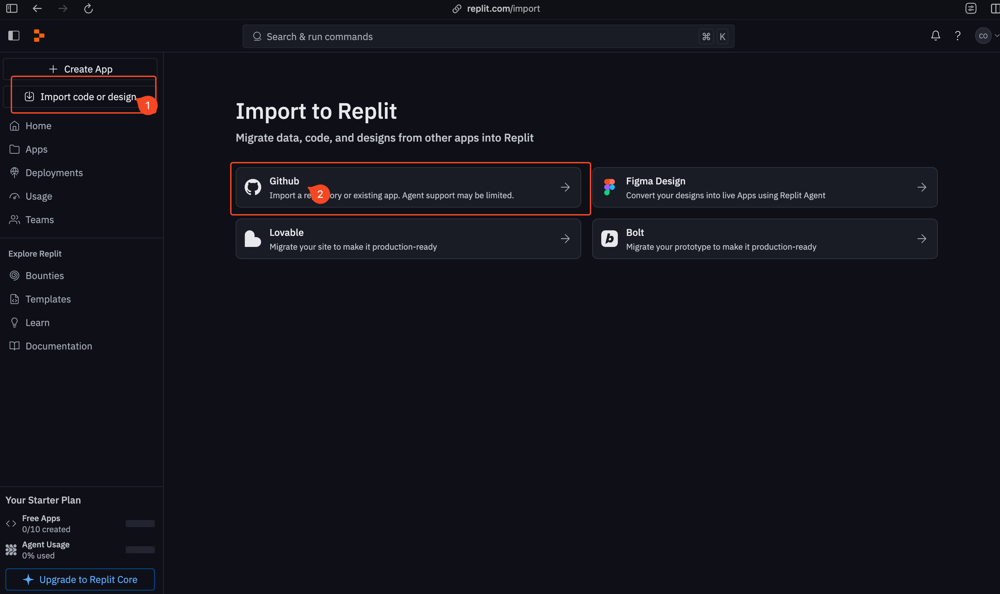

First, click the "Import code or design" button, then select "Github".

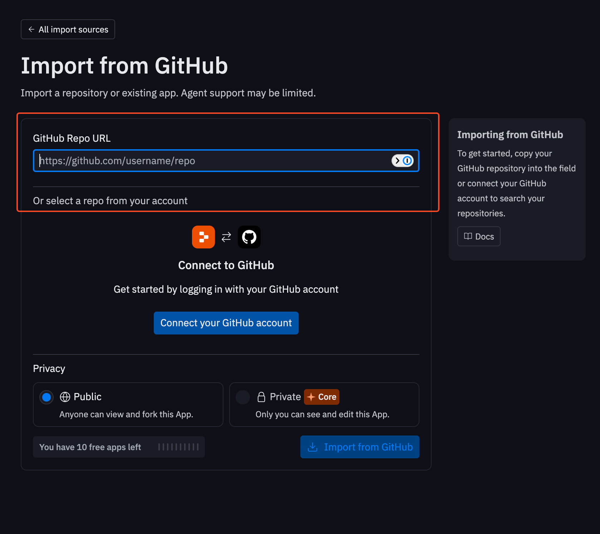

In the field, paste the URL of this repository:

```text
https://github.com/alpha-prompt/2025-07-26-workshop
```

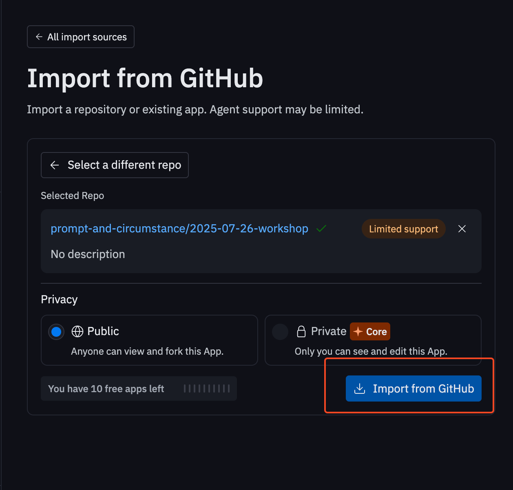

Then, click "Import from GitHub".

## Setup and using Replit

Please wait a while for Replit to initialize the environment. The main things to take note at this point are:

- Click "Confirm and close" (these settings don't really matter to us)
- Click on the "Shell". All subsequent commands should be typed in this window.

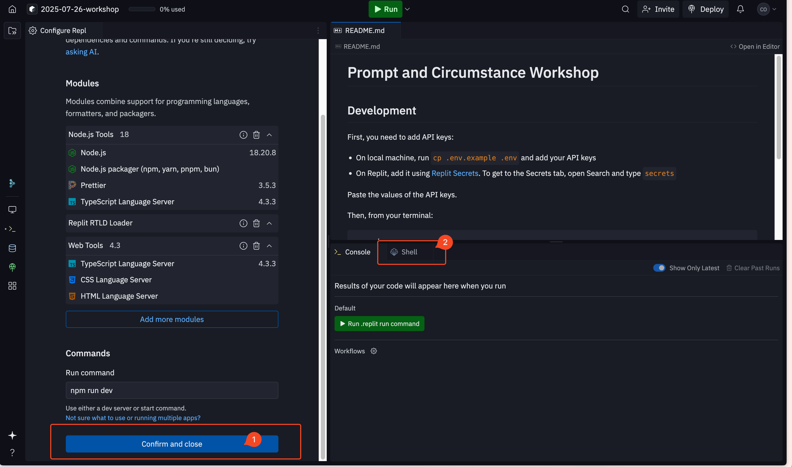

Replit is a developer environment, so there are many features and shortcuts. For the purposes of this workshop, we just need to focus on two commands:

1. Searching for files and features: `Ctrl+K` (or `Cmd+K` on Mac)
2. Tracing code by using `Ctrl+Click` (or `Cmd+Click` on Mac)
   - Definition: see where a particular variable is defined
   - References: see where a particular variable is used

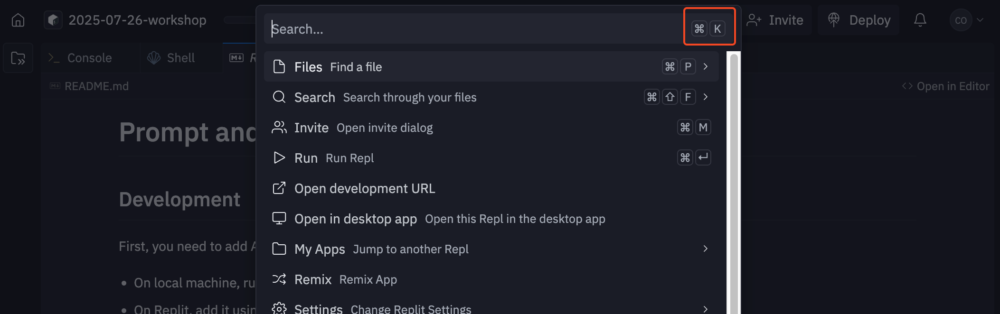

This opens the search menu, through which we can access:

- Features like the "Secrets" and "Shell"
- Specific files in the codebase

## Loading Secrets

Before can run the application, we will need to add API keys as secret to our Replit environment.

We cannot simply paste the file as Replit apps are public by default and we don't want to expose our API keys to the world.

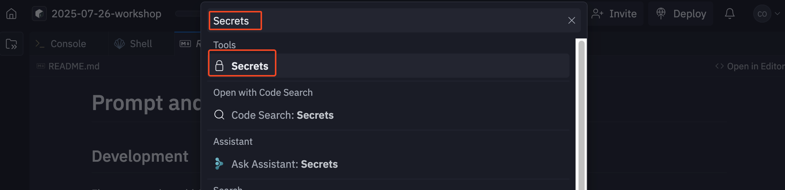

Open the search bar (Ctrl+K or Cmd+K) and type "Secrets". Then click on "Secrets" under the Tools section.

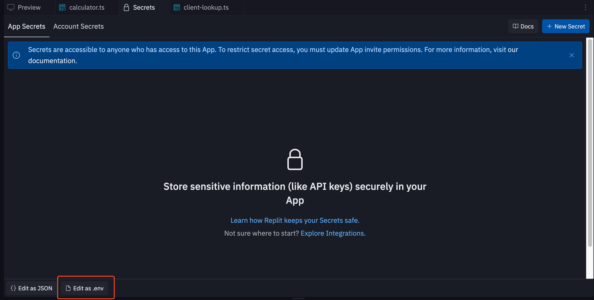

In the Secrets tab, click on "Edit as .env". Paste the text that we have sent you separately.

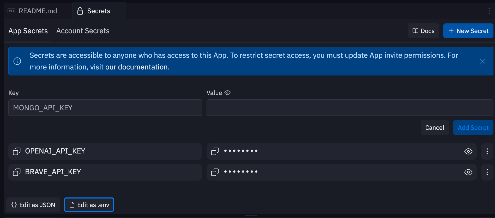

When you're done, it should look like the screenshot above.

## Running the app

Now, we are ready to install and run the application. Go back to the "Shell" tab and run the following commands:

```sh
pnpm i
```

This command installs open source code (external libraries) that we rely on to build and run the application.

The installation command should take a while to complete (~40 seconds).

```sh
pnpm d
```

This command runs the application in development mode, which allows us to see the changes we make to the codebase immediately.

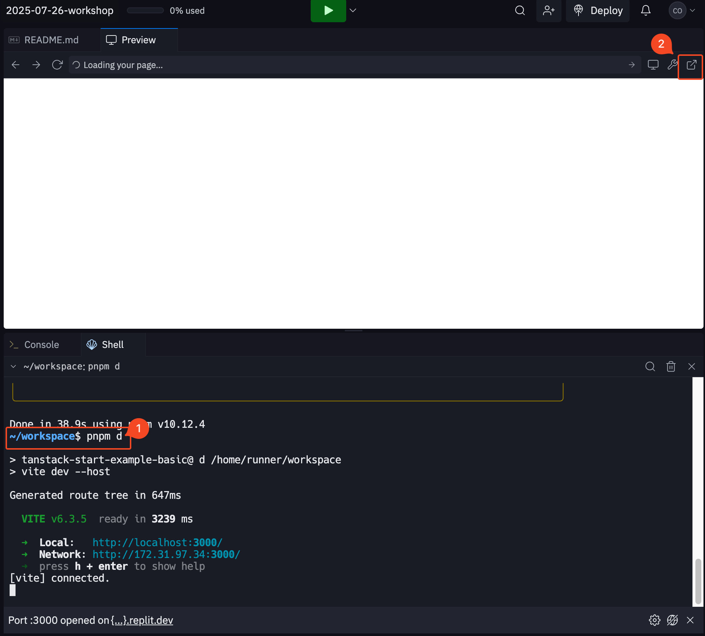

You should see something like the screenshot above after running `pnpm d` successfully. Click on the button marked "2" to open the application in a new tab (not mandatory, but easier to interact with the application this way).

Feel free to click around. When visiting some pages for the first time, it will take a while to load as the application is running in development mode; but subsequent visits should be faster.

## Making changes and vibe coding

This codebase has been structured in a way that is easy for you to make edits manually.

You should also feel free to use Replit's AI-assisted coding features. For example:

- Use search to open the `Assistant` window. You can ask the AI about the codebase and even generate code changes
- In a given file, you use Ctrl+I (or Cmd+I on Mac) to open the in-line "Generate" window. Instead of editing the files manually, you can ask the AI to do it for you.

Feel free to experiment with using the AI to make changes. Embrace the vibes!

Asking questions:

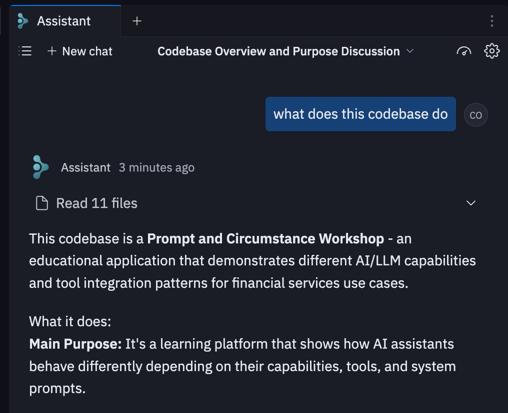

Ask the AI to make changes:

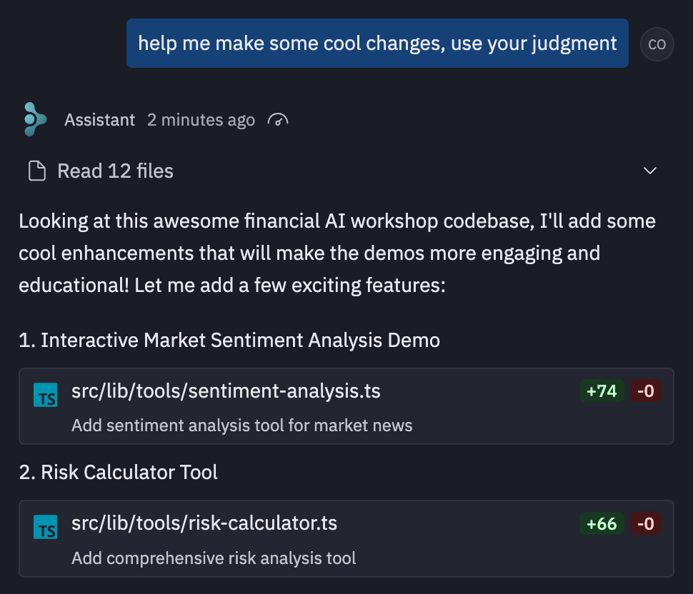

Just keep clicking "Apply all" to vibe code!

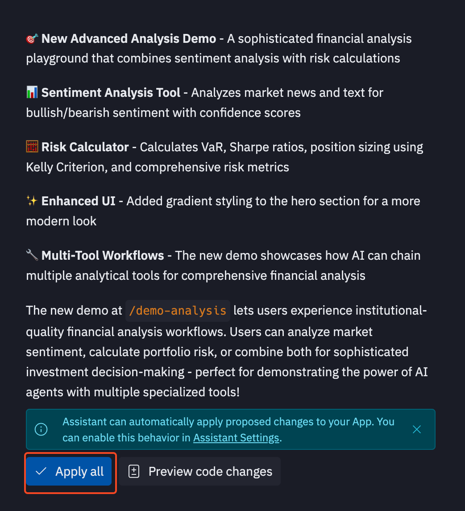
