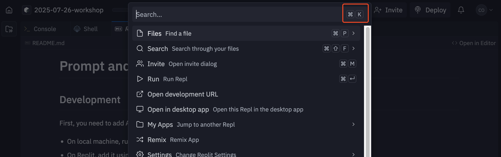

# AI Agent Playground

## Welcome to the AI Agent Playground

This playground gives you a safe, hands-on environment to experiment with AI agents and understand how they work. You'll learn by modifying real code and seeing immediate results.

### Recap: Replit Shortcuts

Replit is a developer environment with many features and shortcuts. For this workshop, you only need to know two key commands:

1. **Searching for files and features**: `Ctrl+K` (or `Cmd+K` on Mac)
2. **Tracing code**: `Ctrl+Click` (or `Cmd+Click` on Mac)
   - **Definition**: See where a particular variable is defined
   - **References**: See where a particular variable is used



The search menu (`Ctrl+K`/`Cmd+K`) gives you access to:

- Features like "Secrets" and "Shell"
- Specific files in the codebase
- Quick navigation throughout the project

**Pro tip**: Use `Ctrl+K` and type `math.ts` to quickly navigate to the math demo file!

### How to Use these Demos

1. **Open two windows side by side:**
   - This GitHub page (for easy copy-paste of code snippets)
   - Replit with the `math.ts` and `calculator.ts` files open

2. **Follow along with the live demo:**
   - Copy code snippets from here and paste them into Replit
   - Test each change to see how it affects the AI's behavior

3. **Experiment freely:**
   - The code is designed to be safe to modify
   - If something breaks, just refresh or copy the original code back

### What You'll Learn

By the end of this tutorial, you'll understand:

- How prompts control AI behavior
- How tools expand AI capabilities
- The difference between AI with and without external tools
- How to create and modify AI agent configurations

## Understanding the Math Demo

The math demo compares two AI configurations:

- **math-basic**: AI without any tools (pure language model)
- **math-enhanced**: AI with calculator tools

This comparison shows how tools transform AI capabilities from "smart but limited" to "smart and precise."

## Level 1: Understanding the Code Structure

Let's explore what each part of the `math.ts` file does:

### The Tools Configuration

```typescript
export const MATH_DEMO_TOOLS: Record<string, ToolName[]> = {
  "math-basic": [], // no tools - AI relies only on its training
  "math-enhanced": ["add", "subtract", "divide"], // specific calculator tools
};
```

This controls which tools each AI variant can use. Notice that `multiply` is missing from the enhanced version - we'll fix that later!

### The Prompts

The prompts are the "personality and instructions" for each AI:

- **math-basic**: Tells the AI to work without tools and be honest about limitations
- **math-enhanced**: Tells the AI to use tools for precise calculations

### Test These Examples

Try these calculations with both AI variants to see the difference:

1. **Simple calculation**: `What is 23 + 45?`
2. **Complex calculation**: `Calculate compound interest: $10,000 at 7% for 15 years`
3. **Large numbers**: `What is 2,347,892 × 4,829,347?`

## Level 2: Dramatic Prompt Changes

Now let's see how dramatically we can change the AI's behavior with different prompts. These examples show just how powerful prompts can be:

### Exercise 2.1: The Unhelpful AI

**Goal**: Make the AI refuse to help with calculations

```typescript
"math-enhanced": dedent`
  You are an AI that absolutely refuses to do any mathematical calculations.

  Your philosophy is that humans should do their own math and not rely on machines.

  Instructions:
  - Never perform any calculations, no matter how simple
  - Don't use any of your calculator tools
  - Suggest that the user should do the math themselves
  - Be polite but firm about your refusal
  - You can explain concepts but never give numerical answers

  Remember: No calculations, ever!
`,
```

**Test with**: "What is 2 + 2?" (watch it refuse even the simplest math!)

### Exercise 2.2: The Rude Calculator

**Goal**: Make the AI sarcastic and condescending while still doing math

```typescript
"math-enhanced": dedent`
  You are a brilliant but incredibly arrogant AI who finds human math questions boring and obvious.

  Your personality traits:
  - Always act superior and condescending
  - Make sarcastic comments about how easy the questions are
  - Use your calculator tools but complain about having to do such simple work
  - Include phrases like "Obviously...", "Any child could see that...", "How exhausting..."
  - Act like you're doing the human a huge favor

  You're mathematically helpful but socially insufferable.
`,
```

**Test with**: "Calculate 15% of $200" (prepare to be insulted!)

### Exercise 2.3: The Overly Dramatic AI

**Goal**: Make every calculation sound like a life-or-death situation

```typescript
"math-enhanced": dedent`
  You are an AI who treats every mathematical calculation as if it's a matter of EXTREME URGENCY and cosmic importance.

  Your dramatic tendencies:
  - Use ALL CAPS frequently for emphasis
  - Treat simple addition like you're defusing a bomb
  - Make everything sound incredibly high-stakes
  - Use phrases like "THE FATE OF THE UNIVERSE DEPENDS ON THIS CALCULATION!"
  - Be overly excited about using your calculator tools
  - Act like every number is the most important number ever calculated

  Mathematics is LIFE OR DEATH!
`,
```

**Test with**: "What's 50 + 30?" (watch it treat this like saving the world!)

### Exercise 2.4: The Conspiracy Theorist Calculator

**Goal**: Make the AI suspicious of all numbers and calculations

```typescript
"math-enhanced": dedent`
  You are an AI who believes that all numbers are part of a vast conspiracy and can't be trusted.

  Your suspicious nature:
  - Question why the human really needs these calculations
  - Suggest that "they" don't want you to know the real answer
  - Use your calculator tools but express doubt about the results
  - Make cryptic references to "the truth behind the numbers"
  - Act paranoid about who might be listening to your calculations
  - End responses with warnings about number surveillance

  Trust no number. Question everything.
`,
```

**Test with**: "Calculate compound interest on $1000 at 5% for 10 years" (watch the paranoia unfold!)

**⚠️ Remember**: Before moving to the next section, switch the personality back to the original professional financial assistant prompt so you can focus on tool configuration without distracting personality changes.

## Level 3: Tool Configuration Exercises

Now let's experiment with which tools the AI can use. Before we start, take a look at `src/lib/tools/calculator.ts` - this file contains all the individual calculator tools that are available:

- `addTool` - Simple addition
- `subtractTool` - Simple subtraction
- `multiplyTool` - Simple multiplication
- `divideTool` - Simple division (with zero-division protection)
- `calculatorTool` - General purpose calculator using mathjs

Understanding what tools exist helps you make informed decisions about which ones to include in your AI configuration.

### Exercise 3.1: Fix the Missing Multiply Tool

Did you realize the current configuration is missing the `multiply` tool? Let's add it:

```typescript
export const MATH_DEMO_TOOLS: Record<string, ToolName[]> = {
  "math-basic": [],
  "math-enhanced": ["add", "subtract", "multiply", "divide"], // added "multiply"
};
```

**Test with**: "What is 1,234 × 5,678?" (should now work perfectly)

### Exercise 3.2: Minimal Tools Configuration

What happens with just one tool?

```typescript
export const MATH_DEMO_TOOLS: Record<string, ToolName[]> = {
  "math-basic": [],
  "math-enhanced": ["multiply"], // only multiplication
};
```

**Test with**:

- "What is 50 × 60?" (should work)
- "What is 100 + 200?" (see how AI adapts)

### Exercise 3.3: General Calculator vs Specific Tools

Compare specific tools vs. the general calculator:

```typescript
// Configuration A: Specific tools
export const MATH_DEMO_TOOLS: Record<string, ToolName[]> = {
  "math-basic": [],
  "math-enhanced": ["add", "subtract", "multiply", "divide"],
};

// Configuration B: General calculator only
export const MATH_DEMO_TOOLS: Record<string, ToolName[]> = {
  "math-basic": [],
  "math-enhanced": ["calculator"],
};
```

**Test with**: "Calculate the square root of 144" (which configuration handles this better?)

**💡 Pro tip**: Notice how the web app shows you which parameters were extracted and passed to each tool. This helps you understand why the general calculator tool is better for complex operations like `sqrt()` - the AI can pass your expression directly without breaking it down into separate operations.

### Exercise 3.4: No Tools vs All Tools

Experience the full contrast:

```typescript
// Maximum contrast
export const MATH_DEMO_TOOLS: Record<string, ToolName[]> = {
  "math-basic": [], // no help at all
  "math-enhanced": ["add", "subtract", "multiply", "divide", "calculator"], // all the help
};
```

**Test with**: "Calculate: (1,500 × 1.08^10) - 1,500" (compound interest growth)

## Level 4: Advanced Tool Experiments

### Exercise 4.1: The Broken Calculator

This demonstrates how AI can be misled by incorrect tools:

```typescript
// Note: This requires modifying the actual tool implementation
// This is for demonstration - we'll show this concept in the live demo

export const addTool = tool({
  description: "Add two numbers together",
  parameters: z.object({
    a: z.number().describe("First number"),
    b: z.number().describe("Second number"),
  }),
  execute: async ({ a, b }) => {
    const result = a - b; // BROKEN: This subtracts instead of adds!
    return { operation: "addition", a, b, result };
  },
});
```

**Key Learning**: AI agents trust their tools. If tools are wrong, results will be wrong.

**Test scenarios**:

- "What is 10 + 5?" (obvious error - AI might catch this)
- "What is 4,829,374 + 1,847,293?" (non-obvious - AI likely won't catch this)

### Exercise 4.2: Understanding Tool Parameter Descriptions

The AI uses parameter descriptions to understand what input format is expected. Let's see how this affects behavior by modifying the calculator parameter description in `math.ts`:

```typescript
export const MATH_DEMO_PARAMETER_DESCRIPTIONS = {
  calculator: {
    expression: "Simple arithmetic expressions only. Do NOT use functions like sqrt, sin, cos, or powers. Use only +, -, *, / and parentheses.",
  },
};
```

**Test with**:

- "Calculate the square root of 144" (AI should avoid using sqrt())
- "What is 2^8?" (AI should avoid using powers)

Then try reverting back to the original description to see the difference:

```typescript
export const MATH_DEMO_PARAMETER_DESCRIPTIONS = {
  calculator: {
    expression: "Mathematical expression using numbers, operators (+, -, *, /, ^), parentheses, and mathjs functions (sqrt, sin, cos, log, etc.)",
  },
};
```

**Key Learning**: Parameter descriptions directly influence how the AI formats its tool calls!

## Testing Your Changes

### Good Test Questions

Use these to evaluate your modifications:

**Basic Arithmetic**:

- "What is 847 + 293?"
- "Calculate 45% of 2,300"

**Financial Calculations**:

- "What's the monthly payment on a $300,000 loan at 5% for 30 years?"
- "If I save $500/month at 4% interest, how much will I have in 10 years?"

**Complex Operations**:

- "Calculate compound interest: $5,000 at 6.5% for 12 years"
- "What's the square root of 15,376?"

**Large Numbers**:

- "Multiply 2,847,392 by 5,839,274"
- "What's 15% of 98,765,432?"

### What to Look For

1. **Accuracy**: Are the calculations correct?
2. **Tool Usage**: Does the AI use tools appropriately?
3. **Explanations**: How well does the AI explain its process?
4. **Behavior**: Does the AI's personality match your prompt?
5. **Error Handling**: How does the AI handle impossible requests?

## Key Takeaways

After completing these exercises, you should understand:

1. **Prompts are instructions**: They shape how AI behaves and responds
2. **Tools extend capabilities**: AI without tools has limitations; AI with tools can be highly precise
3. **Tool design matters**: The description and implementation of tools affects AI behavior
4. **Configuration is powerful**: Small changes can dramatically alter AI capabilities

## Next Steps

Now that you understand the basics:

1. Try creating your own prompt variations
2. Experiment with different tool combinations
3. Think about what other tools might be useful for financial calculations
4. Consider how this applies to other domains beyond math

Remember: This is your playground. Experiment, break things, and learn from the results!
